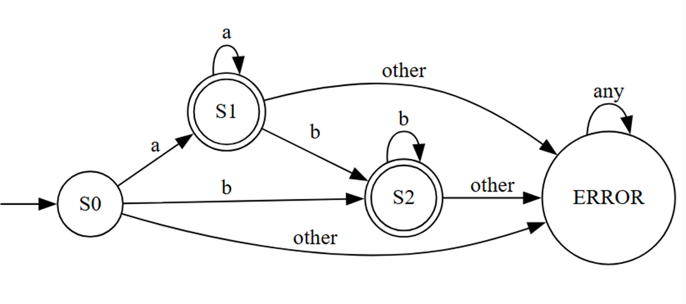

# Лабораторная работа 1

## Конечный автомат

Выполнена студентом III курса

Группа I-2302-ru(ș.e.)

Zabudico Alexandr

Руководитель, преподаватель

V.Trebiș

### Цель лабораторной работы:

Написать программу, реализующую конечный автомат, который распознает слова, имеющие следующий общий вид:

9. a^n b^m , n≥0, m≥0, n+m≥1

```js
const S0 = 0;
const S1 = 1;
const S2 = 2;
const ERROR = -1;

class Automaton {
  constructor() {
    this.state = S0;
  }

  processChar(c) {
    switch (this.state) {
      case S0:
        if (c === "a") {
          this.state = S1;
        } else if (c === "b") {
          this.state = S2;
        } else {
          this.state = ERROR;
        }
        break;
      case S1:
        if (c === "a") {
          // stay in S1
        } else if (c === "b") {
          this.state = S2;
        } else {
          this.state = ERROR;
        }
        break;
      case S2:
        if (c === "b") {
          // stay in S2
        } else {
          this.state = ERROR;
        }
        break;
      default:
        // already error, stay
        break;
    }
  }
}

function identifyWord(automaton, word) {
  for (let char of word) {
    automaton.processChar(char);
    if (automaton.state === ERROR) {
      return false;
    }
  }
  return automaton.state === S1 || automaton.state === S2;
}

// Testing
const correctWords = ["a", "aa", "b", "bb", "aaabbb", "aaa", "bbb"];

const wrongWords = ["", "aba", "ba", "aac", "bbba", "lab", "ab c"];

for (let word of correctWords) {
  const automaton = new Automaton();
  const result = identifyWord(automaton, word);
  console.log(`Word: ${word} Result: ${result}`);
}

for (let word of wrongWords) {
  const automaton = new Automaton();
  const result = identifyWord(automaton, word);
  console.log(`Word: ${word} Result: ${result}`);
}
```

### Результат

```
Word: a Result: true
Word: aa Result: true
Word: b Result: true
Word: bb Result: true
Word: aaabbb Result: true
Word: aaa Result: true
Word: bbb Result: true
Word: Result: false
Word: aba Result: false
Word: ba Result: false
Word: aac Result: false
Word: bbba Result: false
Word: lab Result: false
Word: ab c Result: false
```

Код диаграммы

```
digraph finite_state_machine {
    rankdir=LR;
    node [shape = doublecircle]; S1 S2;
    node [shape = circle];
    invisible [shape=none label=""];
    invisible -> S0;
    S0 [label="S0"];
    S1 [label="S1"];
    S2 [label="S2"];
    ERR [label="ERROR"];
    S0 -> S1 [label = "a"];
    S0 -> S2 [label = "b"];
    S0 -> ERR [label = "other"];
    S1 -> S1 [label = "a"];
    S1 -> S2 [label = "b"];
    S1 -> ERR [label = "other"];
    S2 -> S2 [label = "b"];
    S2 -> ERR [label = "other"];
    ERR -> ERR [label = "any"];
}
```

### Диаграмма


